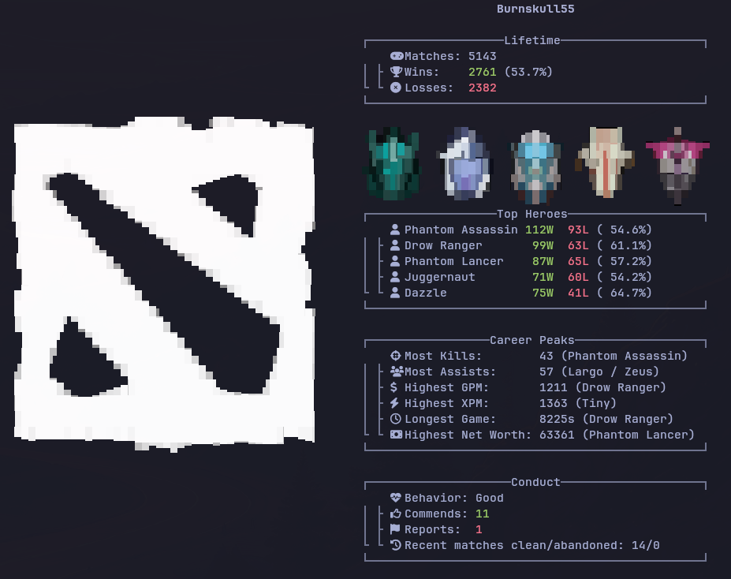

# dotafetch

fastfetch style fetch for dota 2 account info

Reads Dota 2's local stat cache directly — no Steam login, no API key, no
network calls at runtime. Lifetime win/loss totals and per-hero records come
from `stats.dat` under `~/.local/share/Steam/userdata/<id>/570/remote/cfg/`,
which the Dota 2 client itself writes and keeps in sync with your account.
Hero names are looked up from a small table embedded in the binary at build
time; that's the only "external" data involved.

Requires Dota 2 to have been run at least once on this machine so the
client has written its local stats cache.

## Install

```
curl -fsSL https://raw.githubusercontent.com/humbertogfs55/dotafetch/main/install.sh | bash
```

Requires the Rust toolchain (`cargo`) - see https://rustup.rs if you don't
have it. Installs to `~/.cargo/bin/dotafetch`.

## Build & run

```
cargo build --release
./target/release/dotafetch
```
